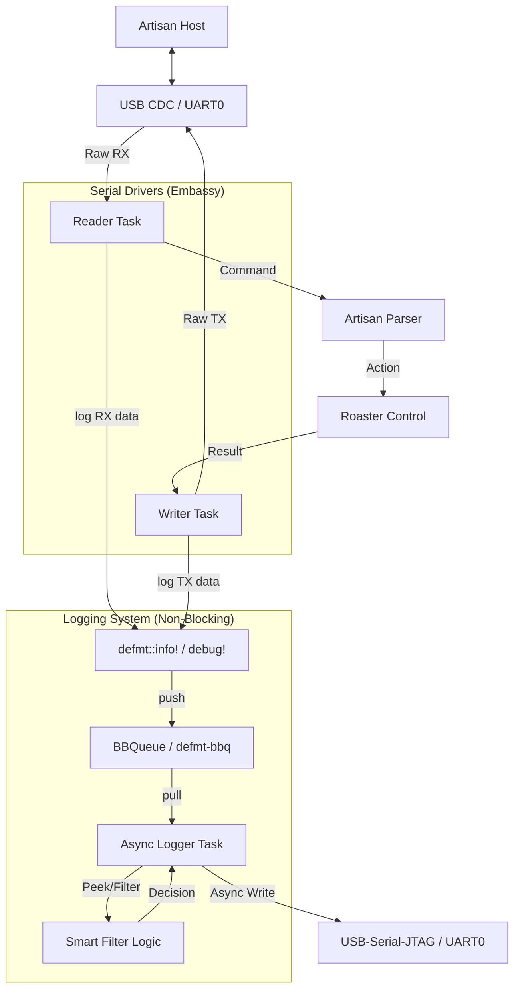

# Architecture Research: Artisan Serial Protocol Integration

**Project:** LibreRoaster v1.7 (ESP32-C3 + Embassy)
**Researched:** 2026-02-05
**Focus:** Non-blocking, channel-aware serial traffic monitoring with Artisan-specific filtering using `defmt-bbq`.

## Recommended Architecture

The logging system must be non-blocking to protect the 100ms PID control loop. It uses a **Producer-Consumer** pattern implemented via `defmt-bbq`, where log submission is decoupled from hardware transmission.

### Component Diagram

### Component Boundaries

| Component | Responsibility | Communicates With |
|-----------|---------------|-------------------|
| **`defmt` Macros** | Encode log data (zero-copy) and push to queue. | Reader/Writer Tasks, BBQueue |
| **`defmt-bbq`** | Global logger shim providing the SPSC buffer. | `defmt`, Logger Task |
| **Logger Task** | Background async task that drains the buffer and writes to hardware. | BBQueue, Smart Filter, Hardware Peripheral |
| **Smart Filter** | Identifies Artisan command types and suppresses noise. | Logger Task |

### Data Flow

1.  **Submission:** When the `Reader` or `Writer` task calls `debug!("RX: {:02x?}", data)`, `defmt` bit-packs the data and `defmt-bbq` pushes it into the `BBQueue`. This happens in a critical section but is extremely fast (sub-microsecond).
2.  **Buffering:** If the `BBQueue` is full, the log is dropped (non-blocking).
3.  **Consumption:** The `DrainTask` (background task) wakes up when data is available in the `BBQueue`.
4.  **Filtering:** The task applies "Smart Filtering" to avoid sending repetitive `READ` responses to the debug port if the filter is active.
5.  **Transmission:** The task uses `esp-hal`'s async `write_all` to send the encoded log frames to the `UsbSerialJtag` or `UART0` port.
6.  **Host Decoding:** The host-side tool (`espflash` or `probe-rs`) decodes the `defmt` frames using the project's ELF file.

## Patterns to Follow

### Pattern 1: Non-Blocking Drop-Oldest
**What:** The `defmt-bbq` logger must be configured to drop logs if the buffer is full.
**Why:** Logging is lower priority than roasting. Blocking the producer tasks (PID/Serial) is not an option.

### Pattern 2: Deferred Formatting
**What:** No string formatting occurs on the ESP32-C3.
**Why:** Formatting strings is CPU-intensive and increases binary size.
**Implementation:** `defmt` handles all formatting on the host PC.

## Anti-Patterns to Avoid

### Anti-Pattern 1: Synchronous `esp-println`
**What:** Using `esp-println` directly for logging in an async environment.
**Why bad:** It blocks the executor when the hardware FIFO is full.

### Anti-Pattern 2: Logging Large Buffers
**What:** Logging 1KB chunks of serial data at once.
**Why bad:** Can quickly overflow the `BBQueue` and the hardware FIFO.
**Instead:** Log smaller chunks or only the parsed command summaries.

## Scalability Considerations

| Concern | 1 Hz Polling | 10 Hz Polling | Stress (Burst) |
|---------|--------------|---------------|----------------|
| **Memory** | Minimal | Constant | ~4KB BBQueue recommended |
| **CPU (Producer)** | Negligible | Negligible | Handshake bursts |
| **CPU (Drain)** | < 1% | ~1-2% | Flushes during idle |

## Sources

- [defmt documentation](https://defmt.ferrous-systems.com/)
- [esp-hal 1.0.0 Async Guide](https://docs.esp-rs.org/esp-hal/)
- [Embassy Sync: Channels and Queues](https://embassy.dev/book/dev/sync.html)
