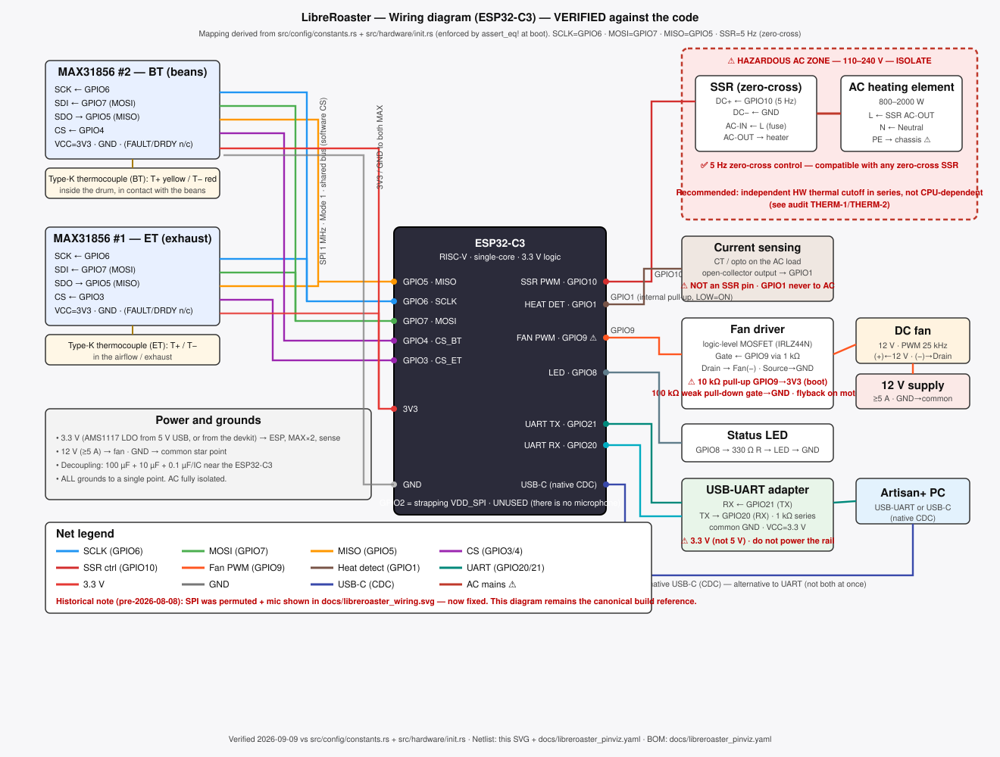
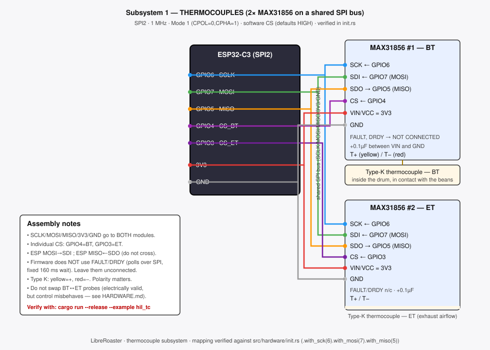
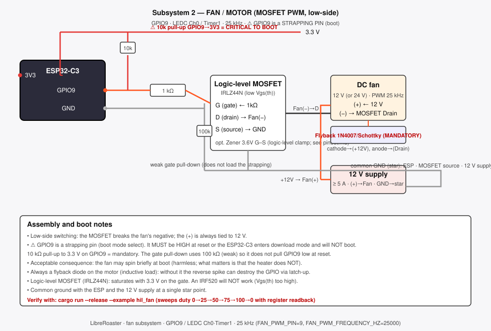
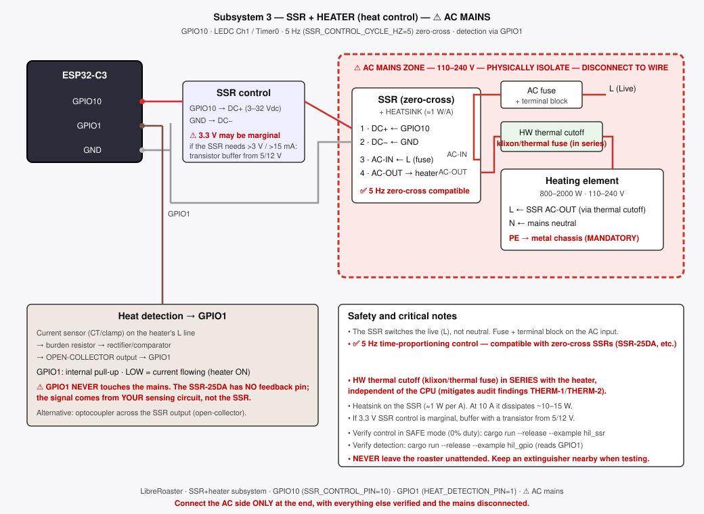
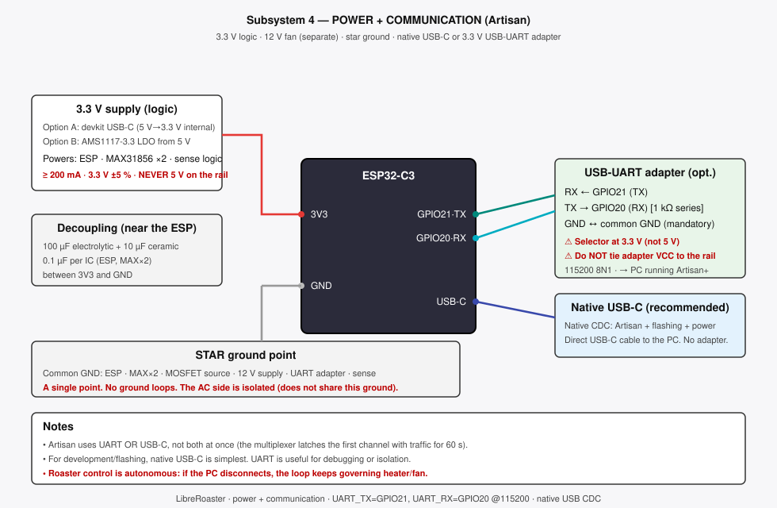

# LibreRoaster — Wiring Diagrams

Wiring diagrams verified against firmware constants (`src/config/constants.rs`) and hardware initialization (`src/hardware/init.rs`).

---

## Full Wiring Diagram

**File:** `docs/diagrams/wiring-diagram.svg`

Complete pin-to-pin wiring of all subsystems on one page. Pin mapping enforced by `assert_eq!` at boot. Use this as the build reference.

**Firmware-verified pinout:**

| GPIO | Signal | Notes |
|:---:|--------|-------|
| 1 | Heat detect | External current-sense circuit, internal pull-up |
| 3 | CS ET | MAX31856 #2 chip select |
| 4 | CS BT | MAX31856 #1 chip select |
| 5 | SPI MISO | ← MAX31856 SDO (GPIO matrix, avoids FSPIQ strapping) |
| 6 | SPI SCLK | → MAX31856 SCK, 1 MHz Mode 1 |
| 7 | SPI MOSI | → MAX31856 SDI |
| 8 | Status LED | Strapping (JTAG), push-pull output |
| 9 | Fan PWM | LEDC Ch0 @ 25 kHz, ⚠ strapping pull-up required |
| 10 | SSR control | LEDC Ch1 @ 5 Hz (zero-cross compatible) |
| 20 | UART RX | ← USB-UART adapter TX, 3.3 V max |
| 21 | UART TX | → USB-UART adapter RX |

**SSR:** `SSR_CONTROL_CYCLE_HZ = 5` (zero-cross, configurable: 5/10 Hz)
**Fan:** `FAN_PWM_FREQUENCY_HZ = 25000` (25 kHz, silent operation)

---

## Subsystem Diagrams

Assemble and verify one subsystem at a time. Each diagram isolates a single subsystem for clarity.

### 1. Thermocouples — SPI + MAX31856 ×2

**File:** `libreroaster_sub_termopares_en.svg`

- Shared SPI2 bus: SCLK=GPIO6, MOSI=GPIO7, MISO=GPIO5
- Individual chip selects: BT=GPIO4, ET=GPIO3
- 1 MHz, Mode 1 (CPOL=0, CPHA=1), software CS (defaults HIGH)
- FAULT/DRDY unconnected (polled via SPI with 210 ms conversion wait)

### 2. Fan / Motor — MOSFET PWM

**File:** `libreroaster_sub_motor_ventilador_en.svg`

- GPIO9 → LEDC Ch0 / Timer1 @ 25 kHz
- Logic-level MOSFET IRLZ44N, low-side switching
- ⚠ GPIO9 is a strapping pin: 10 kΩ pull-up to 3.3 V mandatory
- 100 kΩ gate pull-down (weak, does not load strapping)
- Flyback diode across motor terminals mandatory

### 3. SSR + Heater — AC Mains

**File:** `libreroaster_sub_ssr_calentador_en.svg`

- GPIO10 → LEDC Ch1 / Timer0 @ 5 Hz (zero-cross time-proportioning)
- Compatible with zero-cross SSRs (SSR-25DA, etc.)
- GPIO1 ← external current-sense circuit (open-collector)
- ⚠ AC mains zone: physically isolate, disconnect to wire
- HW thermal cutoff (klixon/thermal fuse) in series with heater — mandatory
- PE to metal chassis mandatory

### 4. Power + Communication

**File:** `libreroaster_sub_alimentacion_comms_en.svg`

- 3.3 V logic rail, 12 V fan power (separate supplies)
- Star ground — all grounds tied to a single point
- Native USB-C (CDC) for Artisan and flashing
- Optional USB-UART adapter at 3.3 V: RX←GPIO21, TX→GPIO20
- UART or USB-C, not both simultaneously

---

## Assembly Order (Recommended)

1. Power + Communication → verify startup
2. Thermocouples → verify readings with `hil_tc`
3. Fan / Motor → verify PWM sweep with `hil_fan`
4. SSR + Heater → verify control with `hil_ssr` (safe mode, duty 0%)
5. Full wiring → verify with `cargo test --features test` and a `--dry-run` of the HIL scripts under `tests/hardware/` (no `preflight-check.sh` is shipped; pin-assignment validation is part of the regular test suite)
6. ⚠ AC mains last, with extinguisher nearby

---

*Diagrams verified against `src/config/constants.rs` (`SSR_CONTROL_CYCLE_HZ=5`, `FAN_PWM_FREQUENCY_HZ=25000`) and `src/hardware/init.rs`. Last updated 2026-05-29.*
